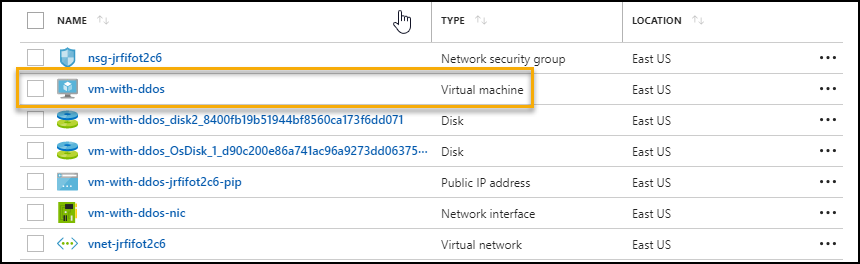
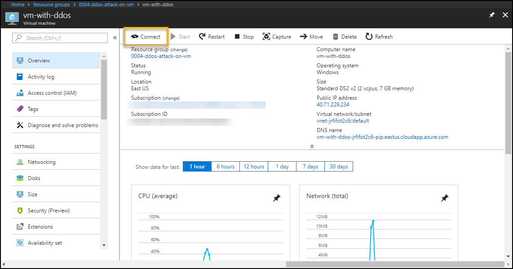
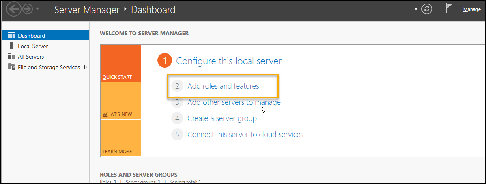
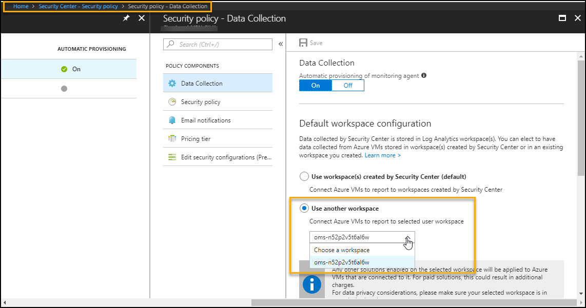
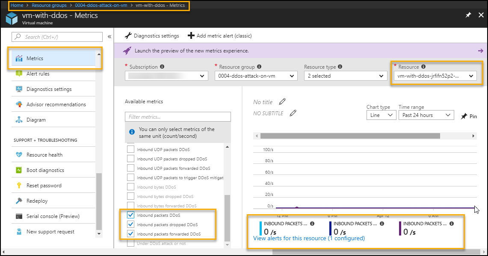
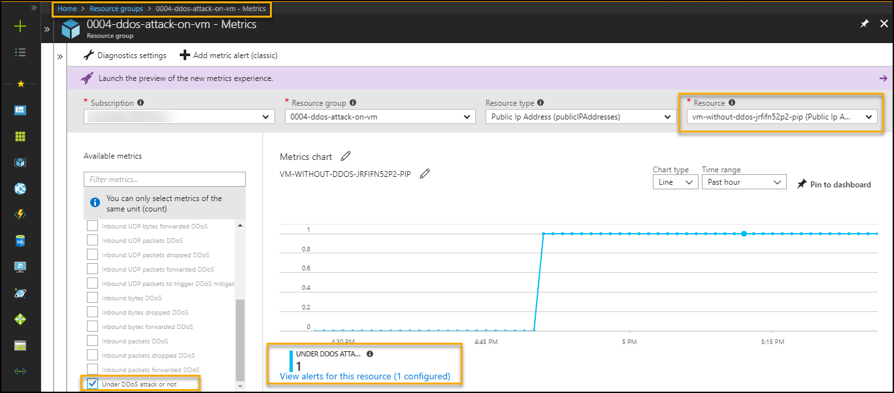
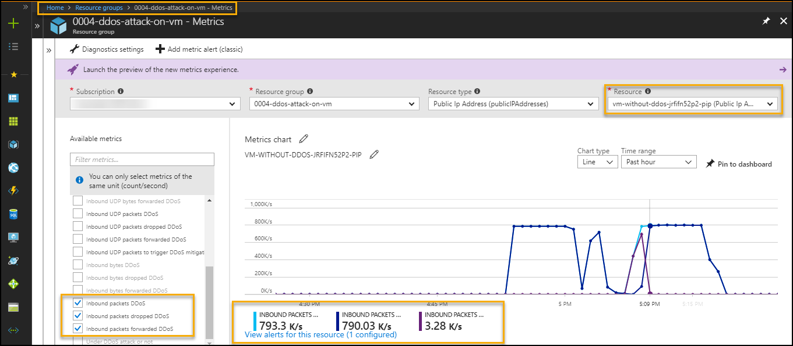

# Objective of the POC
Showcase DDoS protection on azure resources with public IP

# Overview
It showcases following use cases
1. Perform DDoS attack on resources in a virtual network including public IP addresses associated with virtual machines by following configuration --> DDoS protection detects attack and mitigate the DDoS attack and send alert.
    * Virtual Network (VNet enabled DDoS basic protection)

# Important Notes
Azure DDoS Protection Standard is currently in preview. Protection is provided for any Azure resource that has an Azure public IP address associated to it, such as virtual machines, load balancers, and application gateways,You need to register for the service before you can enable DDoS Protection Standard for your subscription. DDoS Protection Standard is available in the East US, East US 2, West US, West Central US, North Europe, West Europe, Japan West, Japan East, East Asia, and Southeast Asia regions only. During preview, you are not charged for using the service.

# Prerequisites
1. Azure subscription should regitered for DDoS protection.
2. Use the [private link](https://aka.ms/ddosprotectionplan) to use DDoS protection feature.
3. Access to Azure subscription to deploy Virtual Machine with Virtual Network

# Deploy

1. Go to Edge Browser and Open [Azure Cloud Shell](https://shell.azure.com/)
1. Change directory to CloudDrive directory 

    `cd $Home\CloudDrive `

1. Clone Azure-Security-Scenarios repos to CloudDrive.

    `git clone https://github.com/AvyanConsultingCorp/azure-security-scenarios.git`

1. Change directory to azure-security-scenarios
 
    `cd .\azure-security-scenarios\`

1. Run below to get list of supported scenarios

    `.\deploy-azuresecurityscenarios.ps1 -Help`

1. If you are using Cloud Shell you can simply pass 2 parameters to run the deployment. Deployment takes  40-45 mins to complete.

    `.\deploy-azuresecurityscenarios.ps1 -Scenario "ddos-attack-on-vm" -Command Deploy  -Verbose`

1. However, if you are running on a local machine pass additional parameters to connect to subscription and run the deployment. Deployment takes  40-45 mins to complete.

    `.\deploy-azuresecurityscenarios.ps1 -SubscriptionId <subscriptionId> -UserName <username> -Password <securePassword> -Scenario "ddos-attack-on-vm" -Command Deploy   -Verbose`

8. To manually configure IIS server on VM follow below steps <br />
    a. Go to Azure Portal --> Select Resource Groups services --> Select Resource Group - "0004-ddos-attack-on-vm" <br />
    b. Select VM with name 'vm-with-ddos'


    

    c. On Properties Page --> Click Connect to Download RDP file --> Save and Open RDP file.


    

    d. Enter login username=vmadmin and password=GY45s@67hx!K
    
    e. Open Server Manager and install Web Server (IIS).


    


    
    
    
8. To configure Azure Security Center, pass `<ConfigureASC>`  switch and  email address `<email id>` for notification

    `.\deploy-azuresecurityscenarios.ps1 -ConfigureASC -EmailAddressForAlerts <email id>`
    
8. Link Azure Security Center to OMS manually as shown in below screen shot


    Azure Portal  - Security Center - Security policy - Select Subscription - Security policy - Data Collection

    
    
    

# Use case - 1 : Attack on VM without DDoS protection
Microsoft Support team executed TCP SYN flood and DNS flood attack on the VM without DDoS protection. In this case DDoS attack can not be detected as shown in below images.
To monitor from matrics to find public IP is under DDoS attack (Does not detect DDoS attack)
    Azure Portal-->Resource Group --> VM --> Metrics --> Select below options
    - Select specific Public IP in resource option 
    - Under DDoS attack or not in metrics filter
    

   


To monitor from matrics to find public IP inbound packets status (Does not detect DDoS attack)
    Azure Portal-->Resource Group --> VM --> Metrics --> Select below options from metrics filter
    - inbound packets DDoS
    - inbound packets dropped DDoS
    - inbound packets forwarded DDoS


   


# Use case - 2 : Attack on VM with DDoS protection 
Microsoft Support team executed TCP SYN flood and DNS flood attack on the VM without DDoS protection. In this case DDoS attack is detected as shown in below images.
To monitor from matrics to find public IP is under DDoS attack (Detect DDoS attack)
    Azure Portal-->Resource Group --> VM --> Metrics --> Select below options
    - Select specific Public IP in resource option 
    - Under DDoS attack or not in metrics filter


   


To monitor from matrics to find public IP inbound packets status (Detect DDoS attack)
    Azure Portal-->Resource Group --> VM --> Metrics --> Select below options from metrics filter
    - inbound packets DDoS
    - inbound packets dropped DDoS
    - inbound packets forwarded DDoS

  
   


The email alert configured at metrics level, This will send the alert mail if VNet is under DDoS attack over last the 5 minutes <br />
  ( Note: Deployment UserName is used to get the email alert for DDoS attack )
  
    
   ]


    
## Clear Deployment 

Run following command to clear all the resources deployed during the demo.

```
.\deploy-azuresecurityscenarios.ps1 -Scenario ddos-attack-on-vm -Cleanup 
```

Verification steps -
1. Login to Azure Portal / Subscription
2. Check if all the ResourceGroup with deploymentSuffix is cleared.


**References** 
