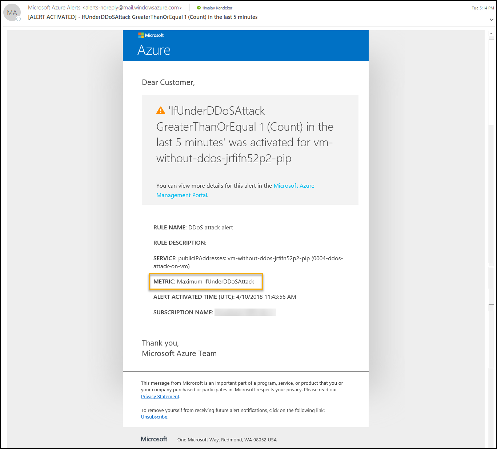

# Table of Contents
1. [Objectives](#objectives)
2. [Overview](#overview)
3. [Important Notes](#important-notes)
4. [Pre-requisites](#prerequisites)
5. [Deploy](#deployment)
6. [Perform Attack](#attack)
7. [Detect & Mitigate Attack](#detect)
8. [Teardown Deployment](#teardown)
9. [References](#references)

<a name="objectives"></a>

# Objective of the POC  
Showcase DDoS Protection Standard on Azure resources with public IP

<a name="overview"></a>

# Overview
It showcases following use cases
1. Perform DDoS attack on resources in a virtual network including public IP addresses associated with virtual machines by following configuration --> DDoS Protection Standard detects attack and mitigate the DDoS attack and send alert.
    * Virtual Network (VNet enabled DDoS Protection Standard)

<a name="important-notes"></a>

# Important Notes
DDoS Protection Standard protects resources in a virtual network including public IP addresses associated with virtual machines, load balancers, and application gateways. When coupled with the Application Gateway web application firewall, DDoS Protection Standard can provide full layer 3 to layer 7 mitigation capability.  
Refer [Azure DDoS Protection Standard](https://docs.microsoft.com/en-us/azure/virtual-network/ddos-protection-overview) for more details.


<a name="prerequisites"></a>

# Prerequisites
1. Access to Azure subscription to deploy Virtual Machine with Virtual Network

<a name="deployment"></a>

# Deploy

1. Go to Edge Browser and Open [Azure Cloud Shell](https://shell.azure.com/)
1. Change directory to CloudDrive directory 

    `cd $Home\CloudDrive `

1. Clone Azure-Security-Scenarios repos to CloudDrive.

    `git clone https://github.com/AvyanConsultingCorp/azure-security-scenarios.git`

1. Change directory to azure-security-scenarios
 
    `cd .\azure-security-scenarios\`

1. Run below to get list of supported scenarios

    `.\deploy-azuresecurityscenarios.ps1 -Help`

1. If you are using Cloud Shell you can simply pass 2 parameters to run the deployment. Deployment takes  40-45 mins to complete.

    `.\deploy-azuresecurityscenarios.ps1 -Scenario "ddos-attack-on-vm" -Command Deploy  -Verbose`

1. However, if you are running on a local machine pass additional parameters to connect to subscription and run the deployment. Deployment takes  40-45 mins to complete.

    `.\deploy-azuresecurityscenarios.ps1 -SubscriptionId <subscriptionId> -UserName <username> -Password <securePassword> -Scenario "ddos-attack-on-vm" -Command Deploy   -Verbose`

8. To manually configure IIS server on VM follow below steps <br />
    a. Go to Azure Portal --> Select Resource Groups services --> Select Resource Group - "0004-ddos-attack-on-vm" <br />
    b. Select VM with name 'vm-with-ddos'


    

    c. On Properties Page --> Click Connect to Download RDP file --> Save and Open RDP file.


    

    d. Enter login details (The VM login username and password is in deployment powershell output)
    
    e. Open Server Manager and install Web Server (IIS).


    


    
               
    
9. To configure Azure Security Center, pass `<ConfigureASC>`  switch and  email address `<email id>` for notification

    `.\deploy-azuresecurityscenarios.ps1 -ConfigureASC -EmailAddressForAlerts <email id>`

10. To create standard DDoS plan and configure with virtual network <br />

    a. Go to Azure Portal --> Click on "Create a resource" --> Search "DDoS Protection  plan"

      
    
    b. Enter details 

      

    c. Configure standard DDoS protection plan on VNet

      


<a name="attack"></a>

# Perform 
 ### * Attack VM without DDoS protection & analyze <br />
Microsoft have partnered with [BreakingPoint Cloud](https://www.ixiacom.com/products/breakingpoint-cloud) to offer tooling for Azure customers to generate traffic load against DDoS Protection enabled public endpoints to simulate TCP SYN flood and DNS flood attack on the VM without DDoS Protection Standard. Create a  support request with [BreakingPoint Cloud](https://www.ixiacom.com/products/breakingpoint-cloud) for simulation of a DDoS attack on infrastructure. The team executed TCP SYN flood and DNS flood attack on the VM without DDoS Protection Standard  <br />

In this case DDoS attack can not be detected as shown in below images. <br />
To monitor from metrics to find public IP is under DDoS attack (Does not detect DDoS attack)  <br />
    Azure Portal-->Resource Group --> VM --> Metrics --> Select below options  <br />
    - Select specific Public IP in resource option   <br />
    - "Under DDoS attack or not" in metrics filter  <br />
    

   


To monitor from metrics to find public IP inbound packets status (Does not detect DDoS attack) <br />
    Azure Portal-->Resource Group --> VM --> Metrics --> Select below options from metrics filter  <br />
    - inbound packets DDoS  <br />
    - inbound packets dropped DDoS  <br />
    - inbound packets forwarded DDoS  <br />


  

 ### * Attack on VM with DDoS Protection Standard <br />

Microsoft have partnered with [BreakingPoint Cloud](https://www.ixiacom.com/products/breakingpoint-cloud) to offer tooling for Azure customers to generate traffic load against DDoS Protection enabled public endpoints to simulate TCP SYN flood and DNS flood attack on the VM without DDoS Protection Standard. Create a  support request with [BreakingPoint Cloud](https://www.ixiacom.com/products/breakingpoint-cloud) for simulation of a DDoS attack on infrastructure. The team executed TCP SYN flood and DNS flood attack on the VM with DDoS Protection Standard <br />


<a name="detect"></a>

# Detect and mitigate attack

The DDoS attack on VM with DDoS Protection Standard is detected and mitigated as shown in below images. <br />
To monitor from metrics to find public IP is under DDoS attack (Detect DDoS attack)  <br />
    Azure Portal-->Resource Group --> VM --> Metrics --> Select below options  <br />
    - Select specific Public IP in resource option   <br />
    - "Under DDoS attack or not" in metrics filter  <br />
 

   


To monitor from metrics to find public IP inbound packets status (Detect DDoS attack) <br />
    Azure Portal-->Resource Group --> VM --> Metrics --> Select below options from metrics filter  <br />
    - inbound packets DDoS  <br />
    - inbound packets dropped DDoS  <br />
    - inbound packets forwarded DDoS  <br />

  
   


The DDoS Protection Standard detects and mitigates the attack on VM. The below image of network metrics of VM while network in attack. <br />
To monitor network in and network out follow below steps <br />
    Azure Portal-->Resource Group --> VM --> Metrics --> Select VM name in resource --> select netork in / out in metrics filter

   
    

The email alert configured at metrics level, This will send the alert mail if VNet is under DDoS attack over last the 5 minutes <br />
  ( Note: Deployment UserName is used to get the email alert for DDoS attack )
  
    
   
   

<a name="teardown"></a>

## Teardown Deployment 

Run following command to clear all the resources deployed during the demo.

```
.\deploy-azuresecurityscenarios.ps1 -Scenario ddos-attack-on-vm -Cleanup 
```

Verification steps -
1. Login to Azure Portal / Subscription
2. Check if all the ResourceGroup with deploymentSuffix is cleared.


<a name="references"></a>

**References** 


1.	 DDoS Blog: http://aka.ms/ddosblog
2.	DDoS Protection overview: http://aka.ms/ddosprotectiondocs
3.	DDoS Standard best practices & reference architecture : http://aka.ms/ddosbest 


## Disclaimer

MIT License 

Copyright (c) 2018 Avyan Consulting Corp.

Permission is hereby granted, free of charge, to any person obtaining a copy of this software and associated documentation files (the "Software"), to deal in the Software without restriction, including without limitation the rights to use, copy, modify, merge, publish, distribute, sublicense, and/or sell copies of the Software, and to permit persons to whom the Software is furnished to do so, subject to the following conditions: 

The above copyright notice and this permission notice shall be included in all copies or substantial portions of the Software. 

THE SOFTWARE IS PROVIDED "AS IS", WITHOUT WARRANTY OF ANY KIND, EXPRESS OR IMPLIED, INCLUDING BUT NOT LIMITED TO THE WARRANTIES OF MERCHANTABILITY, FITNESS FOR A PARTICULAR PURPOSE AND NONINFRINGEMENT. IN NO EVENT SHALL THE AUTHORS OR COPYRIGHT HOLDERS BE LIABLE FOR ANY CLAIM, DAMAGES OR OTHER LIABILITY, WHETHER IN AN ACTION OF CONTRACT, TORT OR OTHERWISE, ARISING FROM, OUT OF OR IN CONNECTION WITH THE SOFTWARE OR THE USE OR OTHER DEALINGS IN THE SOFTWARE.
