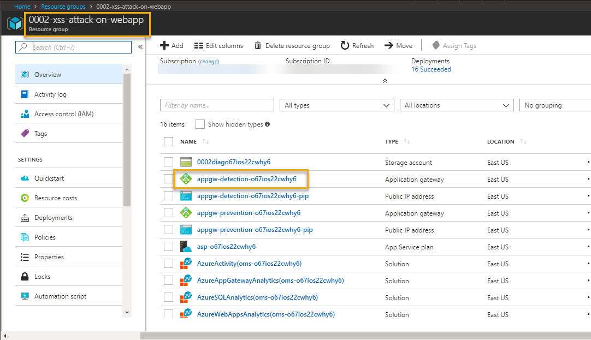
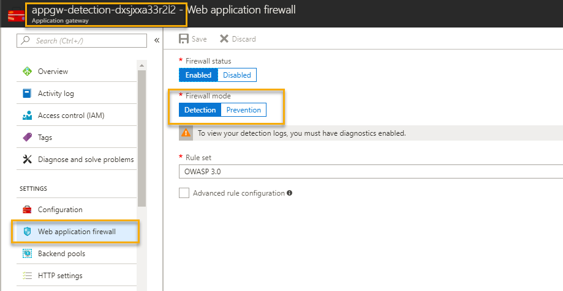
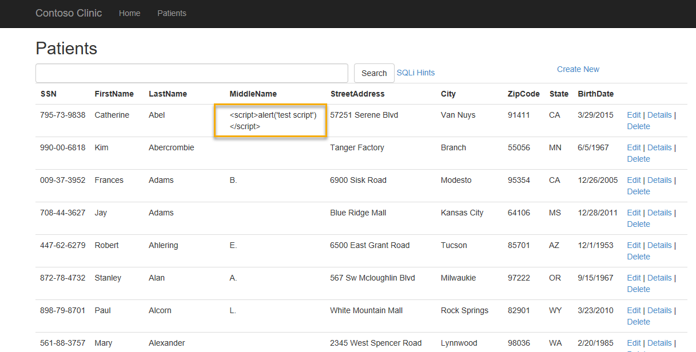

# Table of Contents
1. [Objectives](#objectives)
2. [Overview](#overview)
3. [Pre-requisites](#prerequisites)
4. [Deploy](#deployment)
5. [Perform Attack](#attack)
6. [Detect Attack](#detect)
7. [Respond/Mitigate](#mitigate)
8. [Teardown Deployment](#teardown)

<a name="objectives"></a>
# Objective of the POC
Showcase a Cross Site Scripting (XSS) attack and mitigation on a Web Application 

<a name="overview"></a>
# Overview
It showcases following use cases
1. Perform XSS (Cross Site Scripting) attack on Web App with following configuration --> Application detects attack using application gateway
    * Application Gateway (WAF enabled-Detection mode)
  

2. Perform XSS (Cross Site Scripting) attack on Web App with following configuration --> Application prevents attack using application gateway
    * Application Gateway (WAF enabled-Prevention mode)
  

# Important Notes <a name="notes"></a>
First time it takes few hours for OMS to pull logs for detection and prevention events. For subsequent requests it takes 10-15 mins to reflect in OMS.

<a name="prerequisites"></a>
# Prerequisites
Access to Azure subscription to deploy following resources 
1. Application gateway (WAF enabled)
2. App Service (Web App)
3. SQL Database 
4. OMS (Monitoring)

<a name="deployment"></a>
# Deploy

1. Go to Edge Browser and Open [Azure Cloud Shell](https://shell.azure.com/)
1. Change directory to CloudDrive directory 

    `cd $Home\CloudDrive `

1. Clone Azure-Security-Scenarios repos to CloudDrive.

    `git clone https://github.com/AvyanConsultingCorp/azure-security-scenarios.git`

1. Change directory to azure-security-scenarios
 
    `cd .\azure-security-scenarios\`

1. Run below to get list of supported scenarios

    `.\deploy-azuresecurityscenarios.ps1 -Help`

1. If you are using Cloud Shell you can simply pass 2 parameters to run the deployment. Deployment takes  40-45 mins to complete.

    `.\deploy-azuresecurityscenarios.ps1 -Scenario "xss-attack-on-webapp" -Command Deploy  -Verbose`

1. However, if you are running on a local machine pass additional parameters to connect to subscription and run the deployment. Deployment takes  40-45 mins to complete.

    `.\deploy-azuresecurityscenarios.ps1 -SubscriptionId <subscriptionId> -UserName <username> -Password <securePassword> -Scenario "xss-attack-on-webapp" -Command Deploy   -Verbose`

8. To configure Azure Security Center, pass `<ConfigureASC>`  switch and  email address `<email id>` for notification

    `.\deploy-azuresecurityscenarios.ps1 -ConfigureASC -EmailAddressForAlerts <email id>`
    
8. Link Azure Security Center to OMS manually as shown in below screen shot


    Azure Portal  - Security Center - Security policy - Select Subscription - Security policy - Data Collection

    
    
<a name="attack"></a>
# Perform Attack 
Attack on web app with
* Application gateway - WAF - Detection mode 
 

1. Go to Azure Portal --> Select Resource Groups services --> Select Resource Group - <prefix> "-xss-attack-on-webapp"

2. Select Application Gateway with name 'appgw-detection-' as prefix.

    


3. Application Gateway WAF enabled and Firewall in Detection mode as shown below.

    

4. On Overview Page --> Copy Frontend public IP address as
    

5. Open Internet Explorer with above details as shown below  
    

4. Click on Patient link and select Edit option 

    

4. Perform XSS attack by copying javascript code " **<script>alert('test script')</script>** " in MiddleName text box and click on "Save". 
  


5. Application will save data in database and dispaly it on dashboard
.

        
    
<a name="detect"></a>    
# Detect
To detect the attack execute following query in Azure Log Analytics
1. Go to Azure Portal --> navigate to resource group 'azuresecuritypoc-common-resources' 

 

2. Go to Log analytics --> Click on Log Search --> Type query search 

    ```AzureDiagnostics | where Message  contains "xss" and action_s contains "detected"```

     
    
3. Following details gets logged. 

     
    
<a name="mitigate"></a>
# Mitigate 

  * Update Web application firewall mode to Prevention for application gateway. This will take 5-10 mins. Hence we will connect the application using Application Gateway (WAF- Prevention mode) 

        
    
  

## Detection after Mitigation 

* Execute the step 6 and 7  to perform XSS attack, Application Gateway will prevent access

      

 
* To detect the prevention of attack execute following query in Azure Log Analytics


    AzureDiagnostics | where Message  contains "xss" and action_s contains "blocked"
    
      


You will notice events related to detection and prevention items. First time it takes few hours for OMS to pull logs for detection and prevention events. For subsequent requests it takes 10-15 mins to reflect in OMS, so if you don't get any search results, please try again after sometime.


<a name="teardown"></a>
## Teardown Deployment 

Run following command to clear all the resources deployed during the demo.

```
.\deploy-azuresecurityscenarios.ps1 -Scenario xss-attack-on-webapp -Cleanup 
```

Verification steps -
1. Login to Azure Portal / Subscription
2. Check if all the ResourceGroup with deploymentSuffix is cleared.


**References** 

https://docs.microsoft.com/en-us/azure/application-gateway/application-gateway-introduction
 
https://docs.microsoft.com/en-us/azure/application-gateway/application-gateway-web-application-firewall-overview


## Disclaimer

MIT License 

Copyright (c) 2018 Avyan Consulting Corp.

Permission is hereby granted, free of charge, to any person obtaining a copy of this software and associated documentation files (the "Software"), to deal in the Software without restriction, including without limitation the rights to use, copy, modify, merge, publish, distribute, sublicense, and/or sell copies of the Software, and to permit persons to whom the Software is furnished to do so, subject to the following conditions: 

The above copyright notice and this permission notice shall be included in all copies or substantial portions of the Software. 

THE SOFTWARE IS PROVIDED "AS IS", WITHOUT WARRANTY OF ANY KIND, EXPRESS OR IMPLIED, INCLUDING BUT NOT LIMITED TO THE WARRANTIES OF MERCHANTABILITY, FITNESS FOR A PARTICULAR PURPOSE AND NONINFRINGEMENT. IN NO EVENT SHALL THE AUTHORS OR COPYRIGHT HOLDERS BE LIABLE FOR ANY CLAIM, DAMAGES OR OTHER LIABILITY, WHETHER IN AN ACTION OF CONTRACT, TORT OR OTHERWISE, ARISING FROM, OUT OF OR IN CONNECTION WITH THE SOFTWARE OR THE USE OR OTHER DEALINGS IN THE SOFTWARE.
